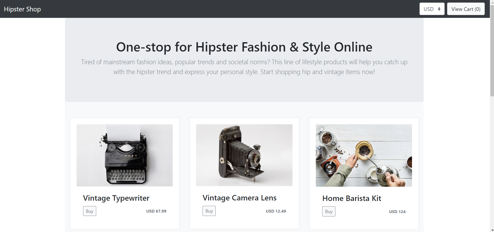
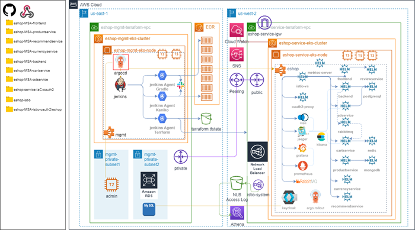

# eshop-PaC(eshop PaC)
Cloud/MSA CI/CD istio 실습용 eshop의 PaC형태의 Repository 레퍼런스

<br>

# feature-c3_1 branch - 3일차 도전과제 3-1 레퍼런스

<br>



<br>


# 3일차 도전과제 3-1 Complete AWS arch

<br>



<br>


### deployment pod 재기동.

<br>

```bash
kubectl -n eshop rollout restart deployment eshop-adservice
kubectl -n eshop rollout restart deployment eshop-backend
kubectl -n eshop rollout restart deployment eshop-cartservice
kubectl -n eshop rollout restart deployment eshop-currencyservice
kubectl -n eshop rollout restart deployment eshop-frontend
kubectl -n eshop rollout restart deployment eshop-productservice
kubectl -n eshop rollout restart deployment eshop-recommendservice
kubectl -n eshop rollout restart deployment postgres
kubectl -n eshop rollout restart deployment rabbitmq
kubectl -n eshop rollout restart deployment redis
kubectl -n eshop rollout restart statefulset mongodb
```

<br>
<br>

### eshop namespace istio injection

<br>

참고. 만일 `eshop` namespace가 없는경우만 실행
>```bash
>kubectl create namespace eshop
>```

<br>

```bash
kubectl label namespaces eshop istio-injection=enabled
```
```bash
kubectl get namespaces -L istio-injection
```

<br>
<br>


### 참고. istio의 간헐적인 OutofSync 무시 설정

Argocd > istio App > App Details > Manifest > Edit > 아래내용 최하단 추가 > Save > Sync

<br>

- 참고 url. https://argo-cd.readthedocs.io/en/release-1.8/user-guide/diffing/

- 참고 url. https://github.com/argoproj/argo-cd/issues/4276
- istio manifest

```yaml
(...생략...)
syncPolicy:
  syncOptions:
    - CreateNamespace=true
(입력)
```
- argocd(CD툴)에서는 istio의 ValidatingWebhookConfiguration 및 MutatingWebhookConfiguration의 caBundle값을 다이나믹하게 삭제되는 변화를 감지한다. Auto Pruning이 없는 상황에서 잦은 istio 상기 설정(caBundle, failurePolicy)의 삭제되어야 하는 부분 발생으로 OutofSync가 발생하게 되는 것이다. 이를 무시하기 위한 옵션을 아래와 같이 manifest에 추가해주게 되면 해당 변화에 대해서는 argocd가 감지하지 않는다.

- istio의 App Details 버튼을 누른 후 Manifest 탭에서 Edit을 클릭하면 위와 같이 manifest가 표출된다.
- 그 후 상기 Manifest의 (입력)란에 아래 코드 입력 (ignoreDifferences는 syncPolicy와 동일 depth)

```yaml
ignoreDifferences:
  - group: admissionregistration.k8s.io
    kind: ValidatingWebhookConfiguration
    jsonPointers:
      - /webhooks/0/clientConfig/caBundle
      - /webhooks/0/failurePolicy
  - group: admissionregistration.k8s.io
    kind: MutatingWebhookConfiguration
    jsonPointers:
      - /webhooks/0/clientConfig/caBundle
      - /webhooks/1/clientConfig/caBundle
      - /webhooks/2/clientConfig/caBundle
      - /webhooks/3/clientConfig/caBundle
```


<br>
<br>


### change global helm vars (eshop/values.yaml)

<br>

```yaml
global.images.* : << ECR URI >>/<< SERVICE NAME >>:<< TAG >>
```

<br>
<br>


### eshop 내 kiali cm diff 무시 설정

Argocd > eshop App > App Details > Manifest > Edit > 아래내용 최하단 추가 > Save > Sync

```yaml
  ignoreDifferences:
    - kind: ConfigMap
      name: kiali
      jsonPointers:
        - /data/config.yaml
```

<br>


### change global vars(eshop/values.yaml)

```yaml
global:
(...생략...)
# Auth
    url:
      base: << DOMAIN >>    # ex) eshop.mspt3.click
      domain: .<< DOMAIN NAME >> :  # ex) .mspt3.click (앞에 "."이 붙어있다).
# Auth
```

```yaml
global:
(...생략...)
# Auth
    keycloak:
      enabled: false
  image:
    registry: 505891794208.dkr.ecr.ap-northeast-2.amazonaws.com
    tag: latest
  sql:
    ## @param global.sql.host AWS RDS service endpoint
    ##
    host: << 개인 AWS RDS maria db endpoint >>          # ex) eshop-service-keycloackdb.cnm5l7zxyphs.us-west-2.rds.amazonaws.com
    ## @param global.sql.port AWS RDS service port
    ##
    port: 3306
    common:
      ## @param global.sql.common.user AWS RDS service username
      ##
      user: admin
      pwd: << 개인 AWS RDS maria db password >>
      pid: Developer
    authservice:
      db: KeycloakDb        # Keycloak DB
  authservice:
    svc: keycloak-http
    port: 80
    user: keycloak
    pwd: keycloak
keycloak:
  replica : 1
  resources:
    limits:
      cpu: 1500m
      memory: 2000Mi
    requests:
      cpu: 300m
      memory: 300Mi
oauth2-proxy:
  enabled: true
# Auth
```

<br>
<br>

### istio helm setting

**root chart values.yaml**
```yaml
global:
  eiparn: <<EIP ARN1>>,<<EIP ARN2>>
  sslcert: <<ACM ARN>>
```

<br>

**charts/istio-discovery/values.yaml**
```yaml
(...생략...)
extensionProviders:
    - name: "oauth2-proxy"
      envoyExtAuthzHttp:
        service: "oauthproxy-service.eshop.svc.cluster.local"  # 설정값 확인
        port: "4180" # The default port used by oauth2-proxy.
        includeHeadersInCheck: # headers sent to the oauth2-proxy in the check request.
            - "cookie"
            - "x-forwarded-access-token"
            - "x-forwarded-user"
            - "x-forwarded-email"
            - "authorization"
            - "x-forwarded-proto"
            - "proxy-authorization"
            - "user-agent"
            - "x-forwarded-host"
            - "from"
            - "x-forwarded-for"
            - "accept"
        headersToUpstreamOnAllow: ["authorization", "path", "x-auth-request-user", "x-auth-request-email", "x-auth-request-access-token", "x-auth-request-user-groups"] # headers sent to backend application when request is allowed.
        headersToDownstreamOnDeny: ["content-type", "set-cookie"] # headers sent back to the client when request is denied.
        (...생략...)
```

<br>
<br>

### istio 배포 수행 후 Route53 Record를 설정한다.

Route53 서비스에 접근하여 Create Record 작업을 수행한다.

- eshop.<< DOMAIN NAME >>
> alias switch on    
> Alias to Network Load Balancer 선택    
> Oregon(us-west-2) 선택    
> Network LoadBalancer 선택    

<br>
<br>

### grafana

<br>

<< DOMAIN >> 변수 : 개인이 설정한 eshop 서비스 도메인의 FQDN(Fully Qualified Domain Name)값

> ex) eshop.mspt3.click


접근 URL    
https://<< DOMAIN >>/grafana    

<br>
<br>

### kiali

<br>

<< DOMAIN >> 변수 : 개인이 설정한 eshop 서비스 도메인의 FQDN(Fully Qualified Domain Name)값

> ex) eshop.mspt3.click

접근 URL    
https://<< DOMAIN >>/kiali    

- (Istio + Keycloak + Oauth2-proxy) 인증을 적용

<br>
<br>

### jaeger-query

<br>

<< DOMAIN >> 변수 : 개인이 설정한 eshop 서비스 도메인의 FQDN(Fully Qualified Domain Name)값

> ex) eshop.mspt3.click

접근 URL    
https://<< DOMAIN >>/jaeger 

<br>

- (Istio + Keycloak + Oauth2-proxy) 인증을 적용


<br>
<br>

### kibana

<< DOMAIN >> 변수 : 개인이 설정한 eshop 서비스 도메인의 FQDN(Fully Qualified Domain Name)값

> ex) eshop.mspt3.click

접근 URL    
https://<< DOMAIN >>/kibana

<br>

- (Istio + Keycloak + Oauth2-proxy) 인증을 적용
  
<br>
<br>

### rabbitmq management ui

<< DOMAIN >> 변수 : 개인이 설정한 eshop 서비스 도메인의 FQDN(Fully Qualified Domain Name)값

> ex) eshop.mspt3.click

접근 URL    
https://<< DOMAIN >>/rabbitmq/
  
<br>
<br>

### prometheus-server

<br>

<< DOMAIN >> 변수 : 개인이 설정한 eshop 서비스 도메인의 FQDN(Fully Qualified Domain Name)값

> ex) eshop.mspt3.click

접근 URL    
https://<< DOMAIN >>/prometheus

<br>

- (Istio + Keycloak + Oauth2-proxy) 인증을 적용


<br>
<br># eshop-PaC3
